# Retro Computer Models

Editable 3D illustrations of classic home and personal computers, plus an
original fictional computer family. Download a
**USDZ** for Quick Look, AR or a compatible viewer, or open the **Blender source**
to edit the geometry, materials and packed textures.

The collection contains **16 models: 14 historical recreations and two original
fictional variants**. All entries have been visually reviewed and approved for inclusion.
The ZX80 includes the completed bottom, supplied top decal, two-sided edge
contacts and case-colored joining rivets.

## Catalog

Previews show the models, not reference photographs. Click a model name for its
limitations and source notes. For a binary file, use GitHub's **Download raw file** button.

| Preview | Model | Downloads |
|---|---|---|
| 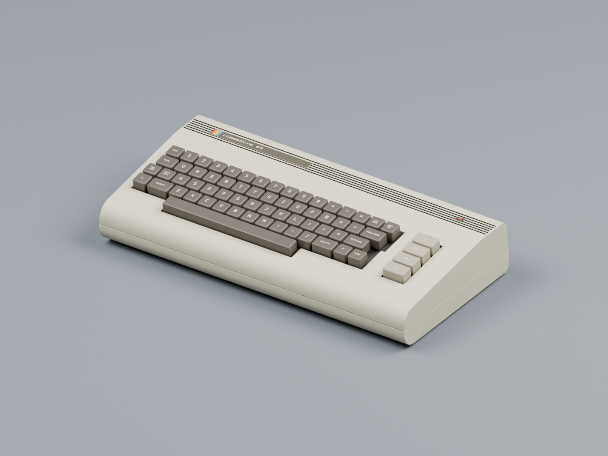 | [Commodore 64](ModelSources/WebPrototypes/) | [USDZ](ModelSources/WebPrototypes/commodore64.usdz) · [Blender](ModelSources/WebPrototypes/commodore64.blend) |
| 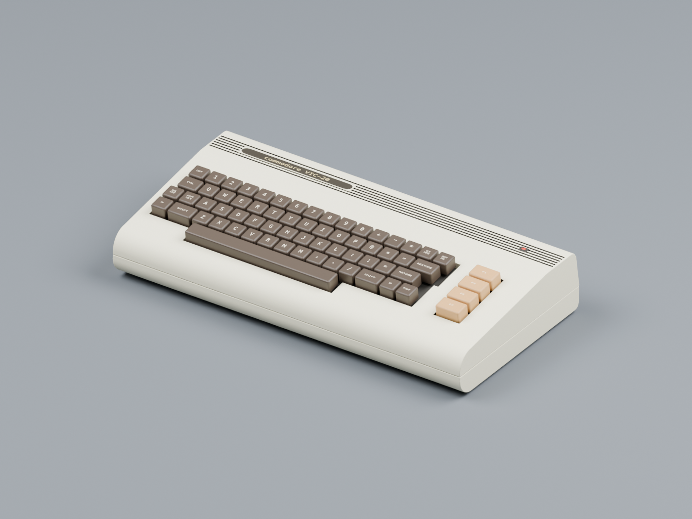 | [Commodore VIC-20](ModelSources/WebPrototypes/) | [USDZ](ModelSources/WebPrototypes/vic20.usdz) · [Blender](ModelSources/WebPrototypes/vic20.blend) |
| 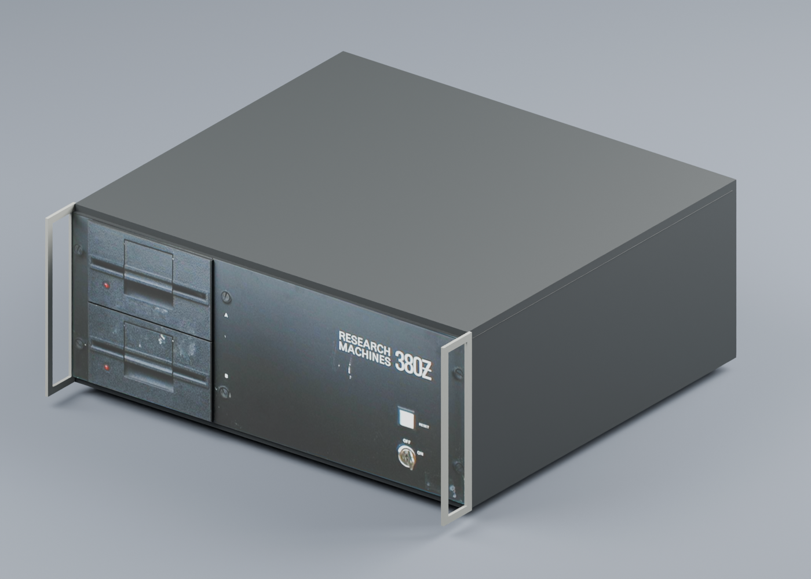 | [Research Machines 380Z](ModelSources/RM380Z/) | [USDZ](ModelSources/RM380Z/researchMachines380Z.usdz) · [Blender](ModelSources/RM380Z/researchMachines380Z.blend) |
| 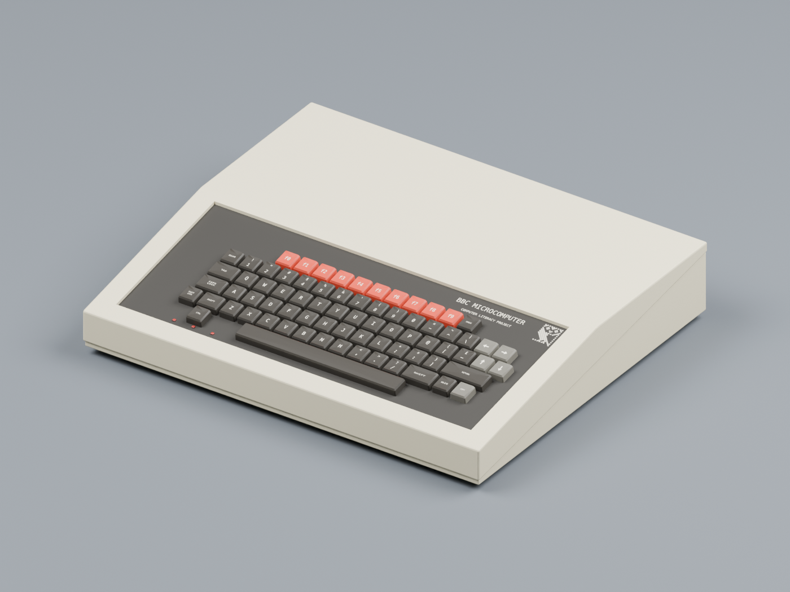 | [BBC Micro Model B](ModelSources/BritishModels/) | [USDZ](ModelSources/BritishModels/bbcMicro.usdz) · [Blender](ModelSources/BritishModels/bbcMicro.blend) |
| 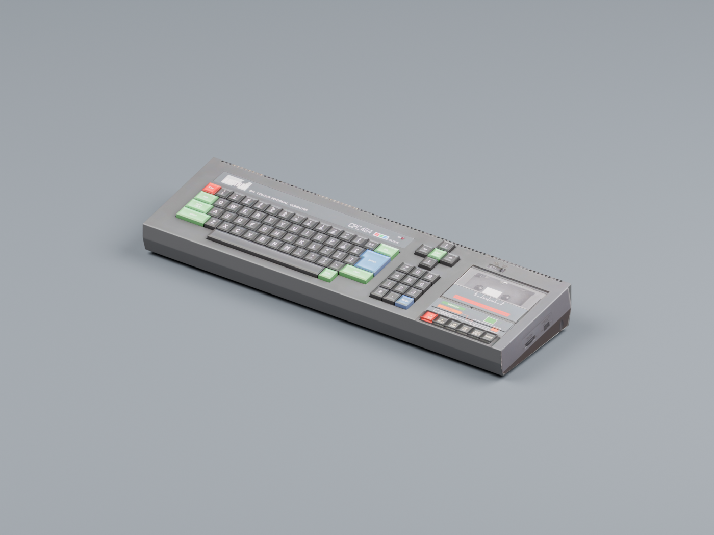 | [Amstrad CPC 464](ModelSources/BritishModels/) | [USDZ](ModelSources/BritishModels/amstradCPC464.usdz) · [Blender](ModelSources/BritishModels/amstradCPC464.blend) |
| 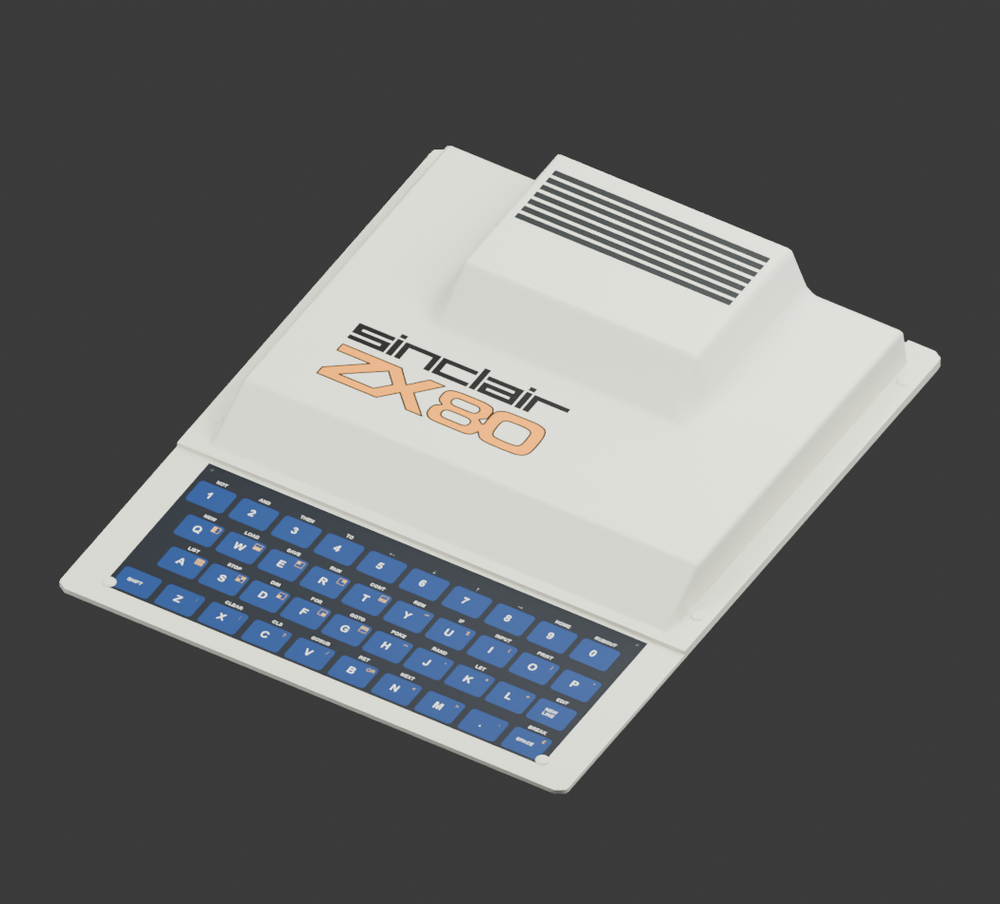 | [Sinclair ZX80](ModelSources/ZX80ReferenceRebuild/) | [USDZ](ModelSources/ZX80ReferenceRebuild/zx80.usdz) · [Blender](ModelSources/ZX80ReferenceRebuild/zx80.blend) |
| 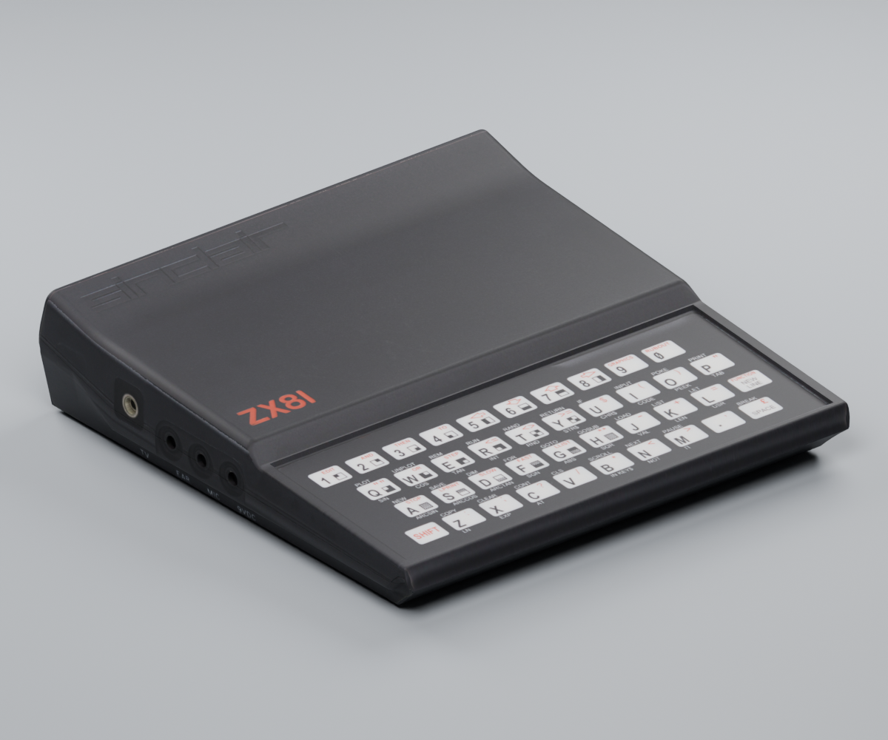 | [Sinclair ZX81](ModelSources/ZX81ReferenceRebuild/) | [USDZ](ModelSources/ZX81ReferenceRebuild/zx81.usdz) · [Blender](ModelSources/ZX81ReferenceRebuild/zx81.blend) |
| 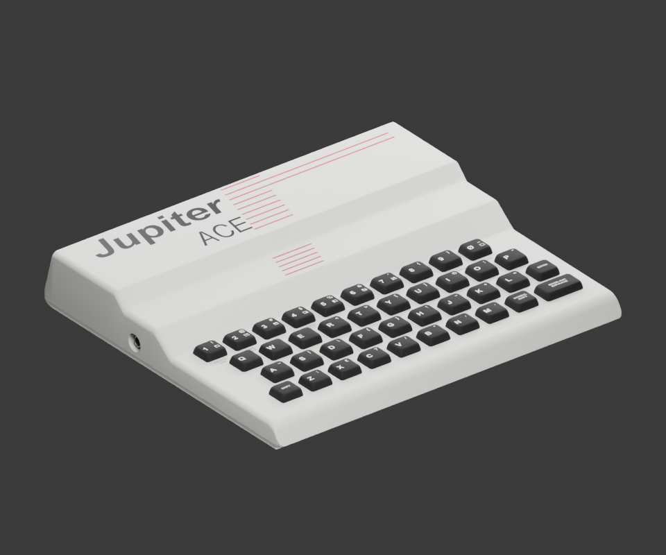 | [Jupiter Ace](ModelSources/JupiterAceReferenceRebuild/) | [USDZ](ModelSources/JupiterAceReferenceRebuild/jupiterAce.usdz) · [Blender](ModelSources/JupiterAceReferenceRebuild/jupiterAce.blend) |
| 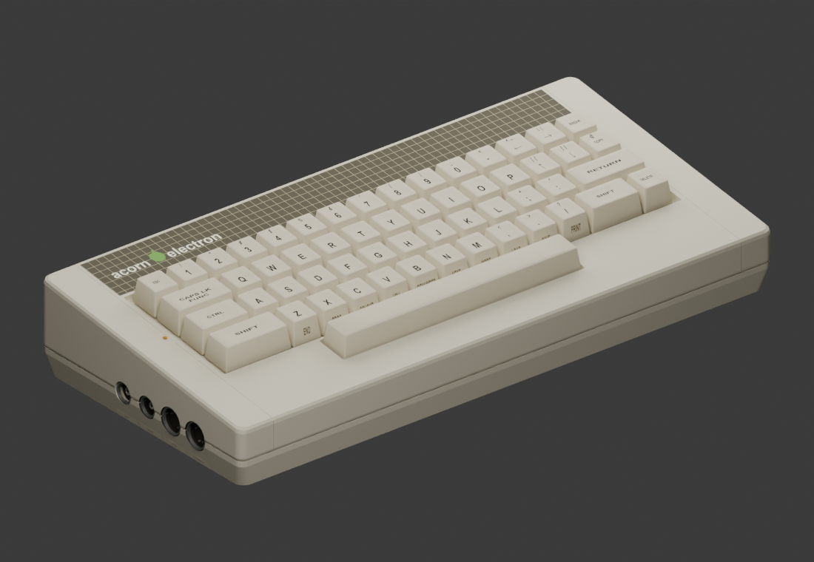 | [Acorn Electron](ModelSources/ElectronReferenceRebuild/) | [USDZ](ModelSources/ElectronReferenceRebuild/electron-review.usdz) · [Blender](ModelSources/ElectronReferenceRebuild/electron-review.blend) |
| 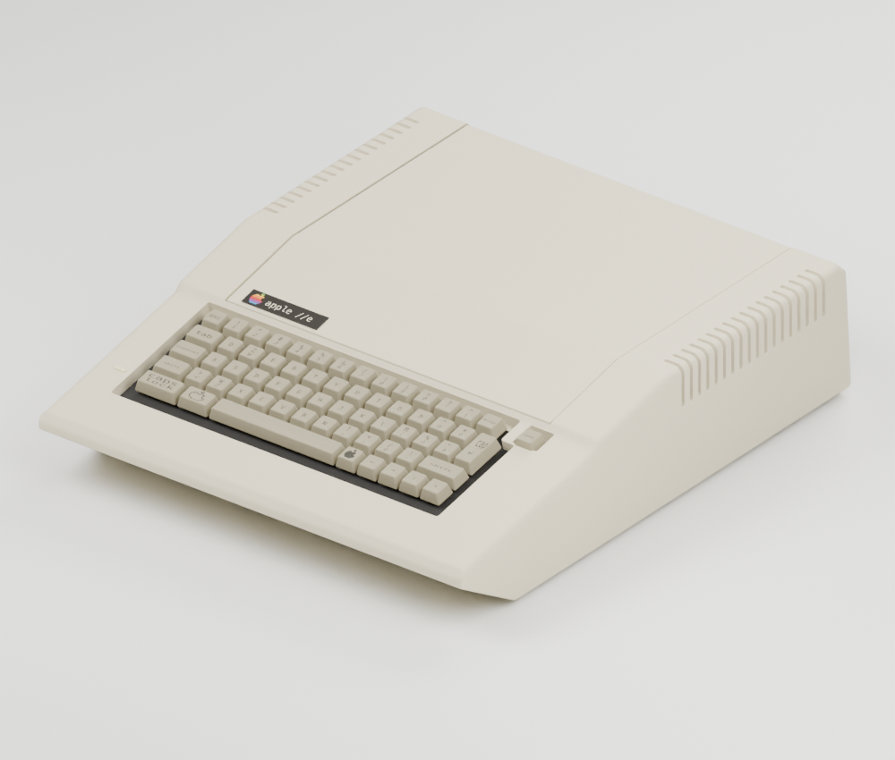 | [Apple IIe — US keyboard variant](ModelSources/AppleIIReferenceRebuild/) | [USDZ](ModelSources/AppleIIReferenceRebuild/appleIIe.usdz) · [Blender](ModelSources/AppleIIReferenceRebuild/appleIIe.blend) |
| 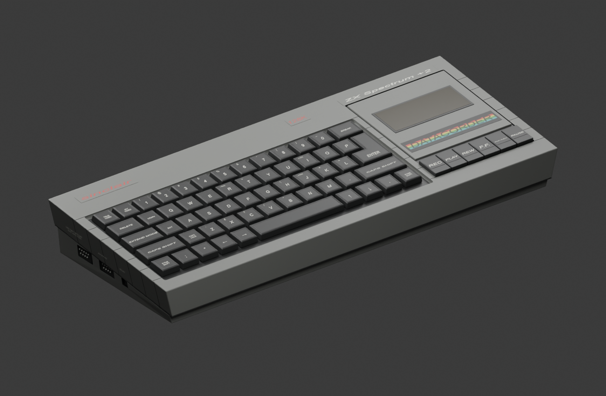 | [Sinclair ZX Spectrum +2 — original grey](ModelSources/SpectrumPlus2/) | [USDZ](ModelSources/SpectrumPlus2/spectrum-plus2.usdz) · [Blender](ModelSources/SpectrumPlus2/spectrum-plus2.blend) |
| 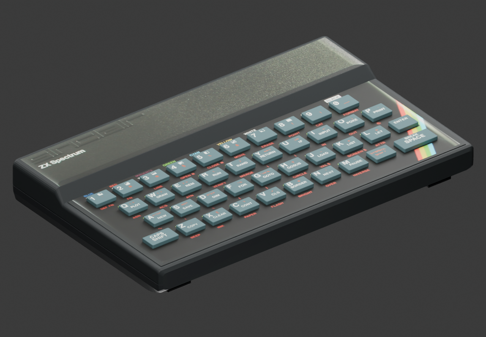 | [Sinclair ZX Spectrum 48K](ModelSources/Spectrum48TS1500/) | [USDZ](ModelSources/Spectrum48TS1500/zxSpectrum.usdz) · [Blender](ModelSources/Spectrum48TS1500/zxSpectrum.blend) |
| 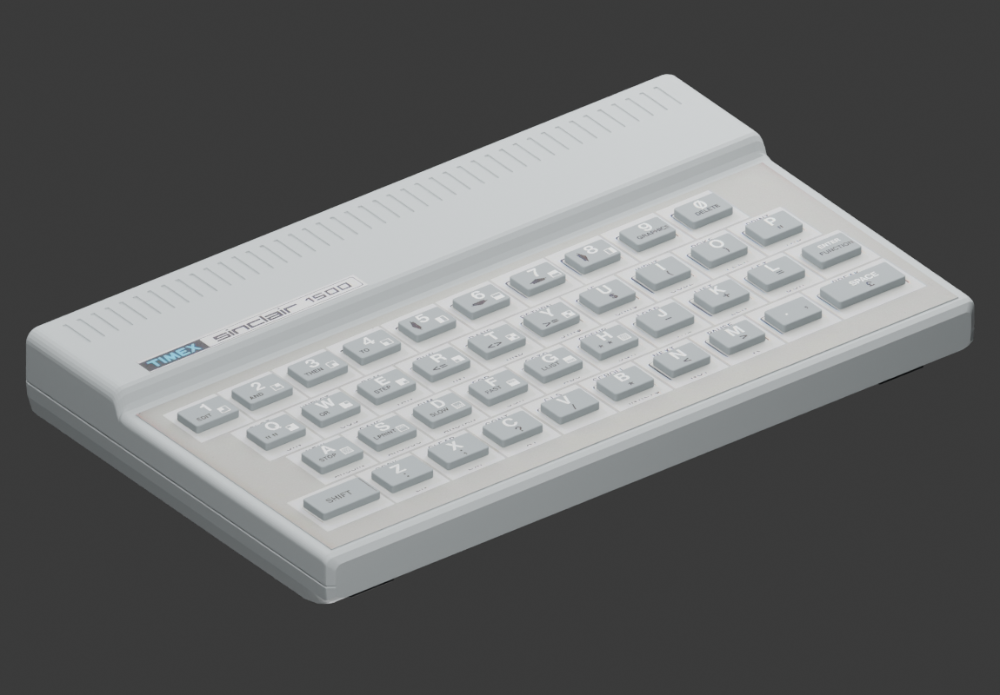 | [Timex Sinclair 1500](ModelSources/Spectrum48TS1500/) | [USDZ](ModelSources/Spectrum48TS1500/timexSinclair1500.usdz) · [Blender](ModelSources/Spectrum48TS1500/timexSinclair1500.blend) |
| 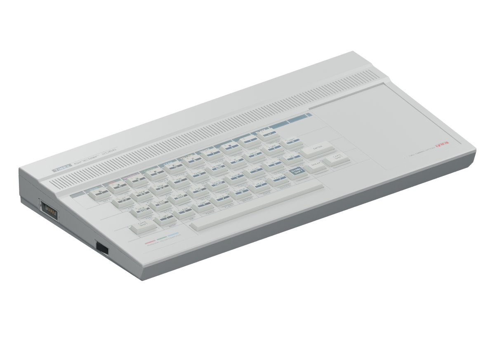 | [Timex Sinclair 2068 — US / NTSC](ModelSources/TS2068ReferenceRebuild/) | [USDZ](ModelSources/TS2068ReferenceRebuild/timexSinclair2068.usdz) · [Blender](ModelSources/TS2068ReferenceRebuild/timexSinclair2068.blend) |

### Original fictional variants

**Retro84 and Retro84 Touch are original imagined 1984 keyboard computers, not
historical machines.** Touch is a budget pressure-sensitive membrane variant,
not a modern touchscreen. The game maps “Membrane / Chiclet” to Touch and other
keyboard choices to the original concept, without changing pricing.
Both are fixed illustrations, not geometry that automatically reflects every
game component choice or case style.

| Preview | Model | Downloads |
|---|---|---|
| 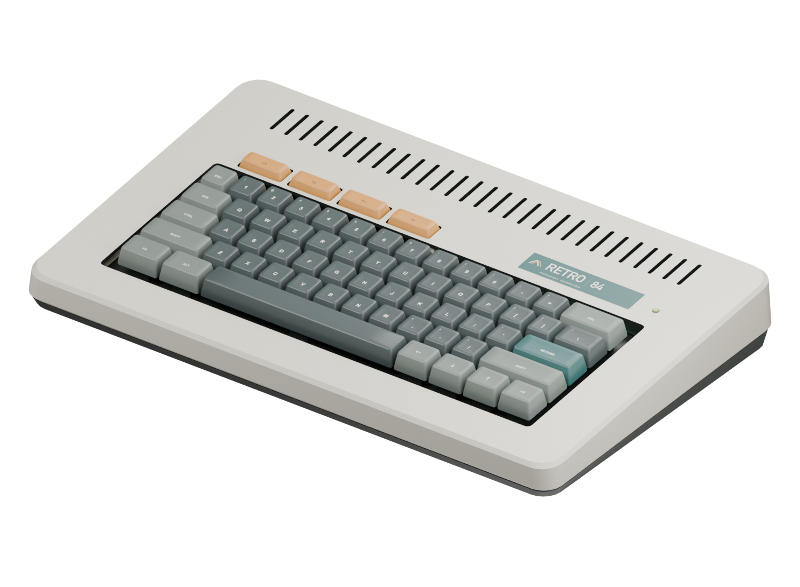 | [Retro84 — original fictional concept](ModelSources/Retro84/) | [USDZ](ModelSources/Retro84/retro84.usdz) · [Blender](ModelSources/Retro84/retro84.blend) |
| 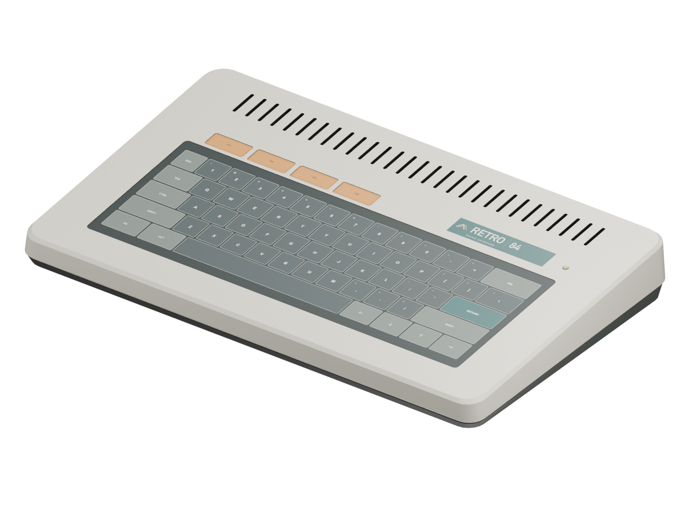 | [Retro84 Touch — fictional membrane variant](ModelSources/Retro84Touch/) | [USDZ](ModelSources/Retro84Touch/retro84Touch.usdz) · [Blender](ModelSources/Retro84Touch/retro84Touch.blend) |

## What is included

- One current `.usdz`, packed-texture `.blend` and standalone preview per model.
- [Usage and export instructions](USAGE.md), minimal export/check tooling,
  [source credits and rights](ATTRIBUTION.md), and a machine-readable
  [catalog](catalog.json) with asset SHA-256 checksums.
- [Verification results](verification.json): isolated packed-scene opening,
  unchanged source geometry/artwork, a packed-scene export test,
  OpenUSD validation and native RealityKit loading/centering.

**Original supplied files are not included separately:** no source photographs,
decals, CAD/STLs or reference archives. Separate texture folders, measurement
inputs and construction/research pipelines are also omitted. Necessary textures
remain embedded in each model so the finished appearance and editability are
preserved. Edit/export from the packed Blender scene; a raw-reference rebuild
is not part of this distribution.

USDZ assets contain model geometry and embedded textures, in metres with Y up.
Blender files retain their editable component structure and, where present,
preview cameras/lights. Named preview grounds and studios are not model parts.
Packed textures let the scenes open without the original workstation.
Some models join several components into one editable mesh with multiple
materials; these are not parametric CAD assemblies.

The historical models are **reference-guided exterior illustrations**; the Retro84
family consists of original fictional product concepts. None are engineering drawings,
certified replicas or ready-to-print replacement enclosures. Rounded edges,
connector interiors, hidden surfaces and artwork can be approximate. Closed
individual meshes can intersect and do not imply a fused printable assembly.
Photographic textures retain some baked illumination, wear and reflections.
Viewers may render materials differently.

## Rights

The existing [MIT license](LICENSE) covers original code and model contributions
owned by the contributor. **It does not relicense third-party photographs,
decals, reference-derived material or trademarks.** See [ATTRIBUTION.md](ATTRIBUTION.md)
before redistributing models, embedded textures or renders.

The contributor has confirmed permission to redistribute supplied photographs
and decals. Known source credits and license notices are retained; that
confirmation is not a blanket MIT grant for those materials. Downloaded reference
photographs, reference STL/3MF files and photo-comparison sheets are not included.
Computer and company names are their owners' marks; no endorsement is implied.
